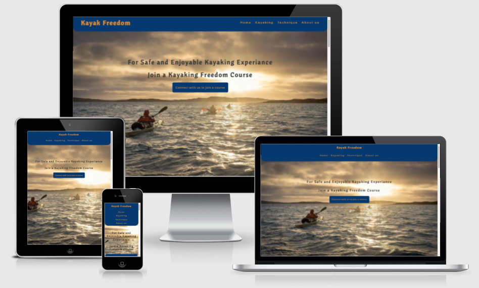

# Kayak Freedom

Welcome to Kayaking Freedom - we provide kayaking cources for you to be safe out on the water, challenge yourself in small steps to be able to get close to the nature. We will prepare your skills for enjoyable experiences and lifelasting memories. Kayaking Freedom target middle age women and men who seek peace and harmony in life and in the same time keep up their health while doing so. Secondary target group are kids to target group one. Kayaking freedom love to see the whole family attending a course. Age limit of 12 is applied as kayaking require maturity, some level of physical strenght as well as the first experiance is lasting it need to be a good one.

[View website on GitHub pages](https://github.com/EvergSwe/Kayak_Classes)

[View website](https://evergswe.github.io/Kayak_Classes/)

## Design Decisions and Features
One Page design approched where choosed as the scope is flat one-subject and informarmation rather straight forward. Color pattern intended is close to the subject water, cliffs, sand with blue/dark greay/light yellow-ish. Font...

### The Header
Mobile first approache for single page the navbar was designed in one Column with Logo on top followed by links to the different section. Media queris added to adapt to bigger screens....

### Landing Page
The landing page, hero text "Safe and Enjoyable Kayaking Experiance" , if you are safe then you will enjoy and have a great experiance...
Hero image illustrates a group of three targeting a far distance iland kayaking on open whater with some medium wind conditions.

### Kayaking Section
The stuff you need

### Technique Section
Intend to provide the viewer an understanding of the learning process and...

### About Us Section
- Contact Details
- Map
- Connect with us form

## Design Process

### Strategy

### Scope

### Structure

### Skeleton

### Surface

## Testing

### User Story

### Feature testing

### UI testing 

### Performance testing

## Error

## Deployment

Different issues has been resolved with developer tools inspection in Google Chrome

## Further Development
